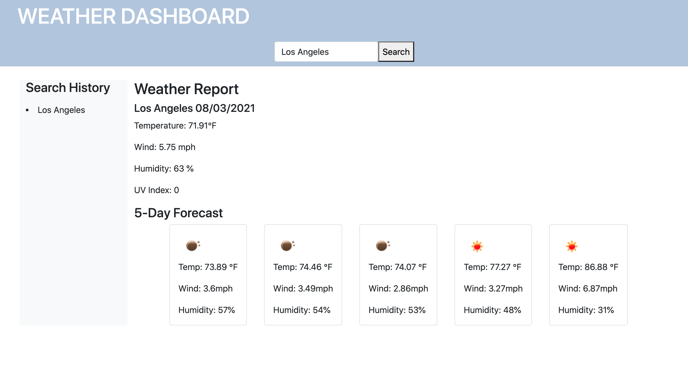

# WEATHER DASHBOARD

## Description
For this project, I created a weather application that allows users to select a city and see the current weather, along with a five-day forcast. I used OpenWeather One Call API to access weather data. 

## Usage
When the user searches for a city, they are presented with current and future conditions for that city, and that city is added to the search history. 

When the user views current conditions for a city, they are presented with the city name, date, an icon representation of weather conditions, temperature, humidity, wind speed, and UV index. 

When the user views the UV index, they are presented with a color that indicates whether conditions are favorable, moderate, or severe.

When the user views future weather conditions for a city, they are presented with a 5-day forcast that displays the date, an icon representation of weather conditions, temperature, wind speed, and humidity.

When the user clicks on a city in the search history, they are again presented with current and future conditions for that city.

## Installation
[Here](https://alyscorpio.github.io/weather_dashboard/) is a link to the deployed application.

[Here](https://github.com/alyscorpio/weather_dashboard) is a link to the application's GitHub repository.

## Contributing
This application was created by Alys Dickerson under the direction of UCLA Coding Bootcamp.

## License
This application is covered under the MIT  license.

## Contact
For more information about my application, visit my [Github](https://github.com/alyscorpio).
For additional questions, please email me at alyssad1182@gmail.com.